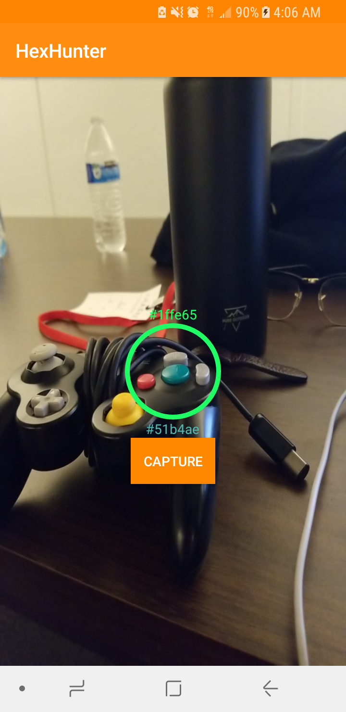

# Hex Hunter (UGAH3) [Nick Bennett, Aizad Mohdzaid, Thomas Yoo, Phillip Lee]

Hex Hunter is an Android app that produces a random *hexadecimal* RGB value, and the player tries to find a color in the real world that matches the random value with his/her camera! Developed for UGA Hacks 3 over a 15 hour period.

## Instructions
Simply point to an item that seems to have the same color as the random value, and hit the button. If you lose, nothing will happen.

## Sources and Libraries
- http://werner-dittmann.blogspot.com/2016/03/solving-some-mysteries-about-androids.html
- http://www.developmentshack.com/android-camera2-api-initialization
- https://opencv.org/

